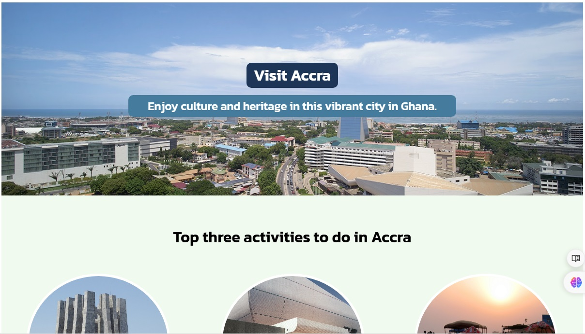

# Hometown Homepage

This project is a simple, responsive webpage designed to showcase the vibrant city of Accra, Ghana. It highlights the top activities to do in the city and introduces the guide, Albert Opoku-Twumasi, who offers insights into the local culture, heritage, and attractions.

## Live Demo

<a href="https://accra-hometown.netlify.app/" target="_blank"></a>

## Table of Contents

- [Project Overview](#project-overview)
- [Technologies Used](#technologies-used)
- [Sections](#sections)
- [How to Use](#how-to-use)
- [Future Improvements](#future-improvements)
- [Contact](#contact)

## Project Overview

The Hometown Homepage features a clean and modern design, utilizing web fonts and images to create an engaging user experience. The webpage consists of three main sections: the hero section, activities section, and guide section.

## Technologies Used

- **HTML5**: For the structure of the webpage.
- **CSS3**: For styling and layout.
- **Google Fonts**: For custom fonts (`Kanit` and `Poppins`).
- **Images**: For visual representation of the city's attractions and the guide.

## Sections

1. **Hero Section**: 
    - Displays the main title "Visit Accra" and a brief introduction to the city.
    - Uses a bold style from the `Kanit` font family.

2. **Activities Section**: 
    - Highlights three major activities in Accra: visiting The Kwame Nkrumah Memorial Park, attending a concert at The Ghana National Theatre, and relaxing at Labadi Beach.
    - Each activity is accompanied by a description and an image.

3. **Guide Section**: 
    - Introduces the local guide, Albert Opoku-Twumasi, with a brief bio and a picture.
    - Encourages visitors to explore Accra with the help of an experienced local.

## How to Use

1. **Clone the Repository**: Download or clone the project repository to your local machine.
    ```bash
    git clone https://github.com/oRocket/hometown-homepage.git
    ```

2. **Open the `index.html` File**: Simply open the `index.html` file in your web browser to view the webpage.

3. **Customizing Content**: 
    - Replace the images in the `images` folder with your own if necessary.
    - Modify the text content in the HTML file to better suit your needs.
    - Update the `style.css` file to customize the design further.

## Future Improvements

- **Responsive Design**: Enhance the webpage to ensure it is fully responsive on all devices.
- **Additional Content**: Add more sections, such as a gallery or testimonials.
- **Interactive Map**: Incorporate an interactive map to showcase different locations in Accra.

## Contact

For any inquiries or suggestions, feel free to reach out:

- **Name**: Albert Opoku-Twumasi
- **GitHub**: [oRocket](https://github.com/oRocket)
- **Twitter/X**: [@Albert_O_T](https://twitter.com/Albert_O_T)

---

Enjoy exploring Accra through this simple yet informative homepage!
